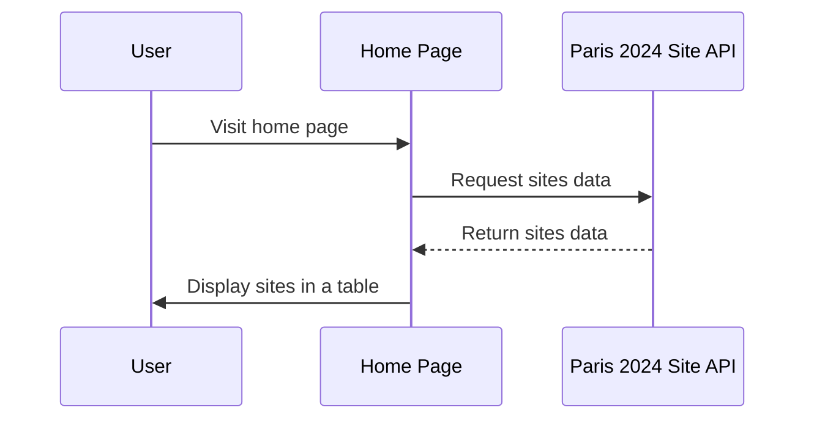

# Architecture Overview

This document provides an overview of the architecture for the feature to retrieve and display a table of sites with their names and sports from the Paris 2024 Site API on the home page.

This sequence diagram illustrates the process flow from when a user visits the home page, through the home page requesting data from the Paris 2024 Site API, to displaying the fetched data in a table format to the user.
